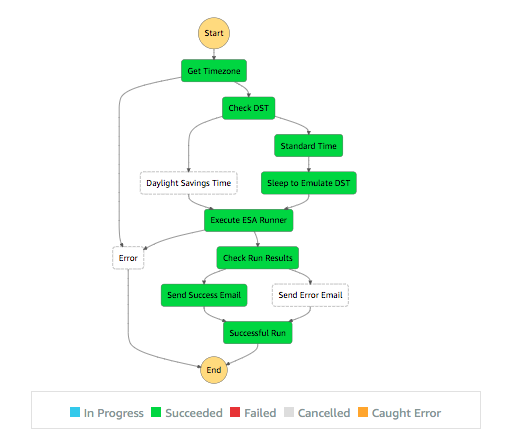
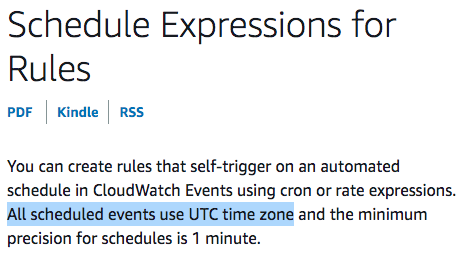

# AWS Step Functions
Case Study for Cronjobs in the Cloud

<!-- Hi all. I'm Nick Evans, a developer from central IT. -->

---

# Step function?
- Finite-state machine
- Put data in a box
- Lines between boxes



<!-- 
So what is a step function? Basically, it's a state machine. 

You've probably worked with something similar before.
-->

---

# What now?


- The boxes do things
    - Lambda
    - SNS / SQS message
    - Start/stop EC2s, ECS tasks, etc
    - Wait for a human to do a thing
    - Sleep

<!-- 
Step functions have native support for a lot of stuff: AWS Batch, Glue, EMR, ECS, EC2, DyanmoDB reads/writes, and probs more things. Anything it doesn't natively support, you can cover for with a Lambda. 

Notably (for me) it DOES NOT support AWS Simple Email Service.
-->

---

# Use cases
- Orchestrate things
- ETL jobs in sequence
- Server patching
- Sky's the limit


<!-- 
The main use case is orchestrating other things.

On the left, we have an official AWS example showing an ETL being orchestrated. It does some kind of wait/check logic for two sets of data and some pre-processing as each dataset becomes available. Once both are ready, the two paths merge back into one and do the final mangling to produce one data set.

CloudWatch can invoke step functions, so you've got these available for TONS of stuff. An S3 PUT for a CSV could invoke a step function that triggers some AWS Glue stuff. 
-->

---

# Why not just use Lambda?
Lambda and the AWS SDK could be used to achieve anything that step functions can.

But step functions make certain things easier.


<!-- Why not just use Lambdas for everything? You could. Plenty of people probably are. -->

---

# <!-- fit --> The Case Study
- Vendor app
- Vendor wrote a custom ASP script that does an ETL from MyHR
- Human goes to the page every Monday morning
- Probably takes a screenshot of the resulting import stats
- **Yuck.** Let's automate that!

<!-- OK, so let's get on to what I actually want to talk about. -->

---

# Development
1. Write a Lambda function
    1. Load some SSM params w/ URLs & credentials
    1. Do an SSO login
    1. `GET` the ASP page
    1. Parse the HTML to extract results
    1. Use MJML to make a nice responsive email w/ the results
    1. Send to a distro list w/ Simple Email Service
1. Terraform the infrastructure
1. Test Lambda execution

<!-- 
So this had a pretty typical development process: I had a problem, so I threw Javascript at it.

Lambda is the first tool I reach for. This is a simple thing to do, should only take a minute to run, bla bla bla.

I did find the cool MJML javascript library. It has an online builder for their templating language, and they emit responsive HTML/CSS that works with all the terrible HTML rendering engines in Outlook/GMail/etc.

BUT. This is pretty typical so far. No step functions in sight.
-->

---

# Schedule in CloudWatch

> Hi Nick,
>
> Please make sure this job runs EXACTLY at eight AM on Mondays.
>
> Regards,
> The Business



<!-- So after testing, I was ready to terraform a scheduled CloudWatch event to trigger my Lambda. -->

---


<!-- meme edited to be venue-appropriate, of course. -->

---

# Scheduling DST-aware CloudWatch Event Rules
- Not a thing.
- Lambda sleeps for an hour?
    - Nope: 15 minute maximum execution time
- Adjust CloudWatch rule twice a year?
    - lol

---

# Step Functions to the Rescue


- Step Functions have a "wait" state that costs nothing ($$)
- CloudWatch fires the Step Function at the early hour
    - Detects if it needs to sleep

---

# Timezone


```js
const moment = require('moment-timezone');

exports.timezone = (event) => {
    return {
        "Timezone": moment()
            .tz('America/Chicago')
            .format('z')
    }
}
```

<!--
Needed a new Lambda: is it CST or CDT?

This was just another handler in my "main" Lambda. I did some things in Terraform so it would use the same uploaded zip file to create several Lambda ARNs, each with a different handler.
-->

---

# Step Function Choice
```json
"Check DST": {
    "Type": "Choice",
    "Choices": [{
            "Not": {
                "Variable": "$.Payload.Timezone",
                "StringEquals": "CST"
            },
            "Next": "Daylight Savings Time"
        },
        {
            "Variable": "$.Payload.Timezone",
            "StringEquals": "CST",
            "Next": "Standard Time"
        }
    ]
},
```

<!--
Here's one of the states for the step function. It's a JSON file. I used the editor in the AWS console to make the bulk of my step function. 

It's pretty simple: the $.Payload is how you reference back to the previous step's output.

Once I had the step function mostly designed, I moved the JSON over to terraform and managed it that way.
-->

---
# Refining It
- While I'm using this nifty Lambda orchestration tool, I can refactor my code to be more focused.
    - "Main" lambda logs in, hits the page, parses HTML
    - Passes the "job log" out
    - Step function choice: >0 job log entries = success Lambda
    - Otherwise failure Lambda
- New lambdas do the emailing parts w/ MJML & SES

---
# "Hm, what if a Lambda fails?"
```hcl
resource "aws_cloudwatch_metric_alarm" "failed_executions_alarm" {
  alarm_name          = "${var.lambda_name}-${var.env}-ExecutionsFailed"
  comparison_operator = "GreaterThanThreshold"
  evaluation_periods  = "1"
  metric_name         = "ExecutionsFailed"
  namespace           = "AWS/States"
  period              = "120"
  statistic           = "Sum"
  threshold           = "0"
  alarm_description   = "Monitors for ${var.app_name} ${var.env} step function errors."
  treat_missing_data  = "ignore"
  actions_enabled     = "${var.alert_on_failure}"
  alarm_actions       = ["${local.opsgenie_sns_arn}"]

  dimensions = {
    StateMachineArn = "${aws_sfn_state_machine.runner_step_function.id}"
  }
}
```

<!--
If my old "main" Lambda failed, I probaby wouldn't notice. When somebody complained, I wouldn't have a record of what ETL result data the page had.

Step Functions solves that second problem for me: since my "main" Lambda is ONLY focused on getting that data, an error with sending the email won't mean the data is lost to the void. It'll still be logged as an output from the Lambda's box.

But since I'm making everything all fancy, I can monitor for ANY part of this step function failing with CloudWatch. The ExecutionsFailed metric for AWS/States looks for ANY box that fails, e.g. the Lambda crashes.

I've got it wired up to SNS, which is making API calls to OpsGenie. We'll know immediately if anything goes awry.
-->

---

# Costs?
- AWS Step Functions are billed per state transition.
    - Lambda exec time, SES costs, etc all still applicable
- 4,000 per month are free
    - $0.025 / 1000 after that
- So, not really expensive.

---

# Next Steps
The IaC module I wrote for this is more generally applicable -- do a thing at the right time, decide if it succeeded, and then call a success or failure Lambda. If a technical problem blows up the state machine, cry to the on-call person.

I plan to turn this into a sharable terraform module. Bring your own Lambda implementation, SNS ARN, and CloudWatch schedule :grin:

---

# The End
Thanks for listening everybody!

- https://mjml.io/ - responsive email templating language 

If you have any questions, you can reach me on the DevIT Slack, or nick.evans@northwestern.edu!